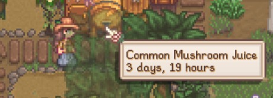
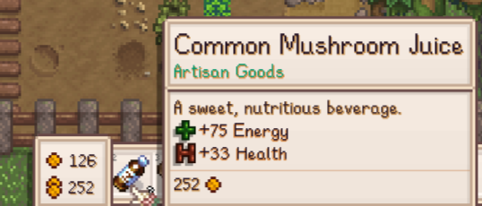

# Brewable Vanilla Mushrooms

A lightweight, vanilla-friendly Content Patcher pack: every vanilla mushroom (plus truffle)
can be placed into a **Keg** to make **juice**, just like vegetables.

Vanilla 1.6 explicitly excludes mushrooms from the keg
(`any vegetable or any positive-energy forage other than mushrooms -> juice`).
This mod lifts that exclusion with a single context tag (`keg_juice`) per item –
no new machines, no scripts, no save edits.

## Contents

- [Features](#features)
- [Covered items](#covered-items)
- [Requirements](#requirements)
- [Install](#install)
- [Balance](#balance)
- [Compatibility](#compatibility)
- [Screenshots](#screenshots)
- [Author](#author)
- [License](#license)

## Features

- Drop any vanilla mushroom into a keg, get flavored juice after ~4 days (6000 min, vanilla time).
- Output is always normal quality (vanilla keg behavior – ingredient stars don't matter, price uses the base value), so ferment normal-quality mushrooms and sell starred ones raw. Price follows the vanilla juice formula (`base x 2.25`).
- Uses `TargetField` edits on `Data/Objects` `ContextTags`, so other mods' tags are kept.

## Covered items

| Item | ID |
|---|---|
| Morel | `257` |
| Chanterelle | `281` |
| Common Mushroom | `404` |
| Red Mushroom | `420` |
| Purple Mushroom | `422` |
| Truffle | `430` |
| Magma Cap | `851` |

Modded mushrooms are intentionally out of scope (see name: *Vanilla*).

## Requirements

- Stardew Valley 1.6
- [SMAPI](https://smapi.io) 4.x
- [Content Patcher](https://www.nexusmods.com/stardewvalley/mods/1915) 2.x

## Install

1. Install SMAPI, then Content Patcher.
2. Download the release zip (`BrewableVanillaMushrooms-1.0.0.zip`).
3. Unzip the `[CP] Brewable Vanilla Mushrooms` folder into `Stardew Valley/Mods`.
4. Run the game via SMAPI. Put a mushroom into a keg.

To uninstall, delete the folder. No save changes are needed (juice already made stays).

## Balance

Truffle is included for completeness (it is a fungus). It does not remove the Oil Maker recipe,
it just gives a choice:

- fast: `Truffle (625g) -> Truffle Oil (1065g)` in 6h via Oil Maker;
- slow but pricier: `Truffle (625g) -> Truffle Juice (~1406g)` in ~4 days via Keg.

## Compatibility

- Multiplayer: every player needs the pack.
- Should be compatible with anything that does not rewrite the same `ContextTags`.
- Preserves Jar / Dehydrator are untouched.

## Screenshots

Common Mushroom fermenting in the keg:

Harvested Common Mushroom Juice (Artisan Goods, +75 Energy / +33 Health):

## Author

Markentyy – [GitHub](https://github.com/Markentyy).

## License

MIT – see [LICENSE](LICENSE).
